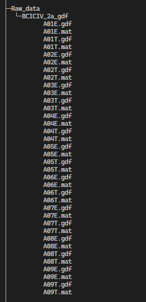

# How to run the code?

The code for ECAI 2024 paper, A study of prototypical network techniques for cross-subject EEG analysis.

In this code, we evaluated our model using [BCI Competition Dataset IV 2a](https://www.bbci.de/competition/iv/results/).

Before running the code, you need to download the raw data (with real labels) and unzip it into the . /Raw_data folder as follows:



Then, run the code with:

```text
python CS_EEGP_IncepMobiNet
```
